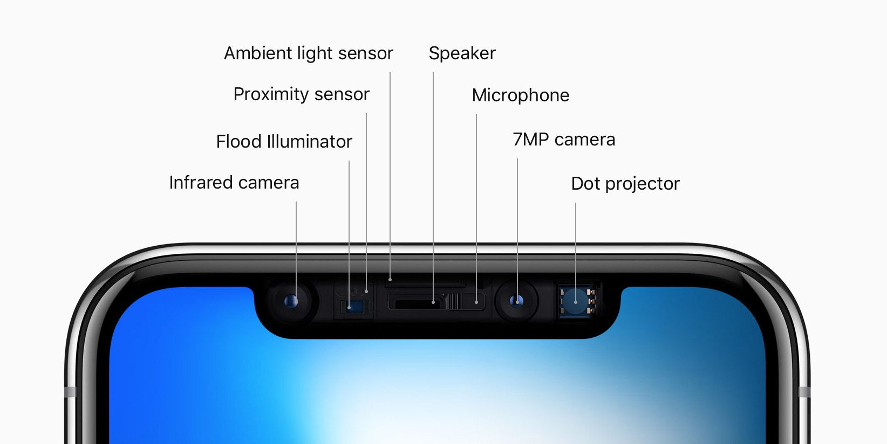
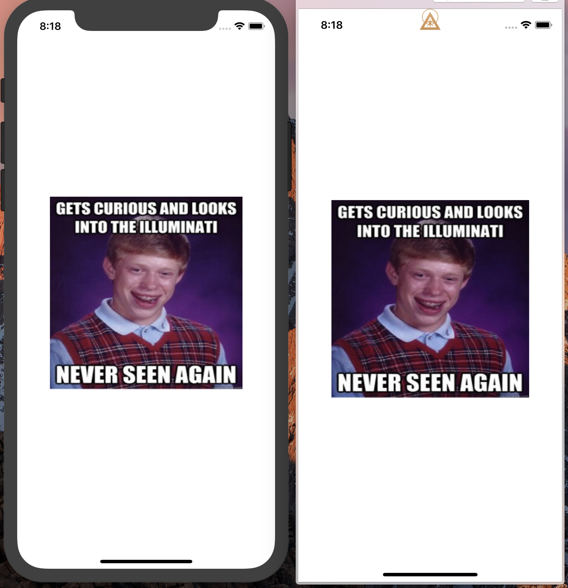
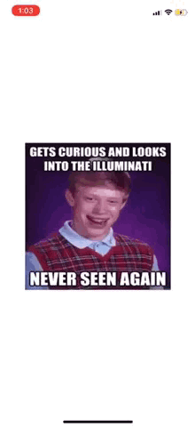

# Illuminotchi
👀 They're watching 👀

Ever wonder whats really going on under the notch?


 
```swift 
"What I'm about to tell you is top secret. A conspiracy bigger than all of us.
There's a powerful group of people out there that are secretly running the world. 
I'm talking about the guys no one knows about, the ones that are invisible. 
The top 1% of the top 1%, the guys that play God without permission. 
And now I think they're following me."
- Justin Beiber
```

This may sound crazy, but there is an ultra-secret group called the **`Illuminotchi`**. They lurk in the shadows and watch us through the notch on the iPhoneX.

## The Proof

An anonymous source reached out to me and told me to [install this library](#install). Thank you good citizen, you may have saved us all.

After adding one line of code, and building my project in Xcode, **my world was turned upside down.**

```swift
Illuminotchi.theyreWatching()
```

👀 👀 👀 **Look what happens when I take a screenshot** 👀 👀 👀

 

## Digging Deeper

This library has some scary implications. The **Illuminotchi** can control what goes under the notch. Its there all he time and we have no idea! I did some digging and heres what I found:

### Adding Text

```swift
Illuminotchi.add(text: "They're watching!")
```

### Adding Attributed Text

```swift
let text = NSAttributedString(string: "They're watching!", attributes: ...)
Illuminotchi.add(attributedText: text)
```

### Adding Images

```swift
Illuminotchi.add(image: UIImage(named: "theyre_watching"))
```

When adding an image, you can add an optional parameter to set the `contentMode: UIViewContentMode` of the underlying `UIImageView`

### Adding Custom Views

```swift
let view = UIView()
...
Illuminotchi.add(customView: view)
```

All views (text, image, custom) are bound by the size of the notch.

## I Don't Have an iPhoneX, Am I Safe?
Probably not.



I also found that the **Illuminotchi** are watching our screenshots. When I run the following code, the [illuminati logo](https://assets.illuminati.mp/media/wp-content/uploads/2017/07/20160349/illuminati-members-portal-icon-illuminati.png) flashes very briefly every time I take a screenshot. 

Try it for yourself, if you're feeling brave 😰.

```swift
Illuminotchi.theyreWatchingYourScreenshots()
```

**Note: must be on device** 


## Practical Use

```
"When life gives you lemons, make lemonade"
- Sevarus Snape
```

The **Illuminotchi** are nefarious, there's no doubting that, but maybe their technology can be put to good use.

You can use this library to add easter eggs for iPhoneX users when they take screenshots of your app! Other than that, theres not much. Fight the power, dont let big brother get you down, and for the love of God dont let your kids use Animoji. 

## Installation <a name="install"></a>

#### CocoaPods

Add the following to your `Podfile`

```ruby
pod 'Illuminotchi', '~> 0.0.1'
```

#### Carthage

Add the following to your `Cartfile`

```ruby
github "jhurray/Illuminotchi" ~> 0.0.1
```

#### Add to project Manually
Clone the repo and manually add [Illuminotchi.swift](./Illuminotchi/Source/Illuminotchi.swift) to your project.

## Contact Info && Contributing

Feel free to email me at [jhurray33@gmail.com](mailto:jhurray33@gmail.com) or [hit me up on the twitterverse](https://twitter.com/JeffHurray). I'd love to hear your thoughts on this, or see examples where this has been used.

[MIT License](https://github.com/jhurray/Illuminotchi/blob/master/LICENSE)

